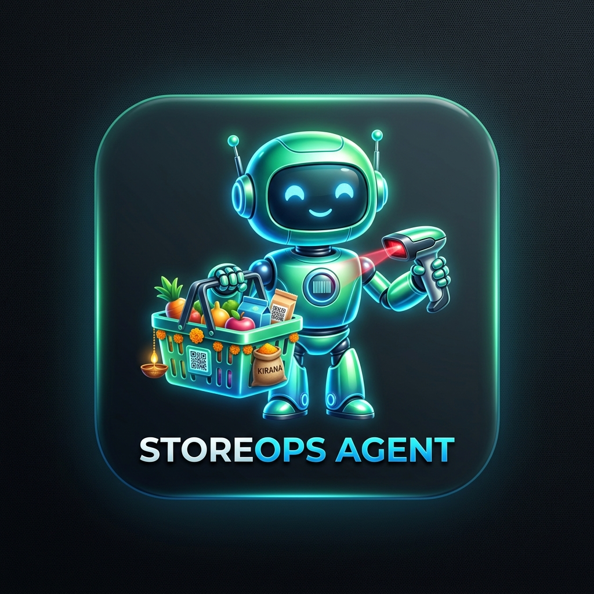

# 🛒 StoreOps Agent – AI Supermarket & Retail Operations Assistant

<p align="center">
  
</p>

> **An autonomous conversational agent that runs a supermarket & Indian kirana store end-to-end through Telegram chat only — with an agent, not a menu.**

[](https://openjdk.org/)
[](https://spring.io/projects/spring-boot)
[](https://www.postgresql.org/)
[]()

---

## 🤖 Live Telegram Bot

- **Live Telegram Bot Handle**: [@MyKiranaPilot_bot](https://t.me/MyKiranaPilot_bot)

---

## 1. Harness Choice & Architectural Rationale

Rather than locking the domain into rigid, hardcoded if/else routing or a rigid graph state machine (which fails over dynamic human phrasing), **KiranaPilot** uses a **Tool-Calling Agent Harness** paired with **Atomic Domain Services**:

1. **Model-Orchestrated Tool Calling**: The LLM autonomously observes shopkeeper phrasing, extracts intent, queries catalog data via tools, executes actions, and reasons over the tool responses in a loop.
2. **Business Rules Live in Tools & Database, NOT Prompts**:
   - Oversell protection is guarded via atomic database queries (`UPDATE products SET quantity = quantity - :qty WHERE id = :id AND quantity >= :qty`).
   - GST calculations (0%, 5%, 12%, 18%), 50/50 CGST/SGST splits, and half-up rounding are computed deterministically using `BigDecimal` in Java.
   - Financial ledger balances are derived from immutable transaction logs.
3. **Pluggable LLM Provider Layer**: Native support for **Google Gemini** (`gemini-1.5-flash`), **OpenAI** (`gpt-4o`), **Anthropic Claude** (`claude-3-5-sonnet`), or a high-fidelity **Mock test harness** for offline CI/CD test execution.

---

## 2. The Agent Control Loop

```
Telegram Message (Text / Voice / Command)
            │
            ▼
┌────────────────────────────────────────────────────────┐
│ TelegramBotService                                     │
│  - Deduplicates update_id in processed_messages        │
│  - Injects conversation history & session memory       │
└───────────────────────────┬────────────────────────────┘
                            │
                            ▼
┌────────────────────────────────────────────────────────┐
│ AgentOrchestrator (Control Loop)                       │
│                                                        │
│   1. Observe: Receive user message & store preferences │
│   2. Reason:  Prompt LLM with tool schemas & context  │
│   3. Act:     Execute requested tool(s) in parallel    │
│   4. Feedback: Feed tool result back to LLM context    │
│   5. Iterate: Loop until task complete (or final text) │
└───────────────────────────┬────────────────────────────┘
                            │
            ┌───────────────┴───────────────┐
            ▼                               ▼
    Domain Services                  Real Artifacts
  • InventoryService               • OpenPDF GST Invoice
  • BillingService                 • Apache POI PPTX Deck
  • KhataService                   • Text / Markdown Output
  • AnalyticsService
```

---

## 3. How the 9 "Hard Parts" Are Solved

| # | Challenge | KiranaPilot Solution |
|---|-----------|----------------------|
| **1** | **Grounding** | Product existence, cost prices, selling prices, GST rates, and stock quantities are loaded strictly via tool execution against PostgreSQL. Prompt instructions forbid the model from hallucinating non-existent items or rates. |
| **2** | **Oversell Guard** | Enforced at the SQL transaction layer: `UPDATE products SET quantity = quantity - :qty WHERE id = :id AND quantity >= :qty`. If affected rows = 0, transaction rolls back immediately with `InsufficientStockException`. Zero negative stock. |
| **3** | **GST Correctness** | Deterministic `GstCalculator` with exact intra-state 50/50 CGST + SGST split, line-item rounding (`HALF_UP`), and taxable base extraction. Verified by automated unit tests. |
| **4** | **Multi-Turn Bills** | Active carts stored in `bill_drafts` per chat. Supports mid-bill additions, quantity updates, and removals (`drop the butter, make it 6 Maggi`). Stock is decremented **only upon finalization**. |
| **5** | **Idempotency** | Telegram `update_id` stored in `processed_messages`. Duplicate webhooks or redelivered polling updates are discarded before hitting business logic. |
| **6** | **Concurrency** | Atomic database queries with optimistic / row locking in transactional boundaries (`@Transactional(rollbackFor = Exception.class)`). Simultaneous checkouts on same SKU cannot corrupt inventory. |
| **7** | **Guardrails** | Refuses below-cost selling warnings, guards against accidental inventory wipes, rejects Khata settlements on non-existent customers or invalid negative ledger adjustments. |
| **8** | **Real Artifacts** | Clean GST Tax Invoice PDF generated on-the-fly using **OpenPDF** with HSN table; Weekly Business Analysis Deck generated using **Apache POI** (.pptx) with KPI dashboard and chart tables. Delivered as native Telegram document attachments. |
| **9** | **Cross-Session Memory** | Standing preferences (e.g. `default_payment_mode = UPI`, `default_atta = Aashirvaad 5kg`, `store_name`, `store_gstin`) persist durably in `owner_preferences` table. `/new` clears chat context while preserving store memory. |

---

## 4. Capability Surface & Tool Definitions

- **Inventory Tools**:
  - `receive_stock`: Inward stock intake with cost and MRP adjustments.
  - `add_product`: New SKU onboarding with unit, HSN, and GST slab.
  - `check_stock` / `search_products`: Real-time stock & price lookup.
  - `get_low_stock`: Lists SKUs at or below safety reorder threshold.
- **Billing Tools**:
  - `add_bill_item` / `update_bill_item` / `remove_bill_item`: Multi-turn cart modifications.
  - `set_payment_mode`: Set CASH, UPI (with ref), CARD, or KHATA.
  - `finalize_bill`: Atomic stock verification, decrement, and invoice generation.
  - `cancel_draft_bill`: Discard active draft.
- **Khata / Credit Ledger Tools**:
  - `add_customer_credit`: Record customer credit purchases ("put ₹500 on Ramesh's credit").
  - `record_customer_payment`: Record settlement payments ("Ramesh paid ₹300").
  - `get_customer_balance` / `get_customer_statement`: Real-time ledger balances and audit trail.
- **Analytics & Reporting Tools**:
  - `get_daily_sales_summary`: Today's sales turnover, tax collected, cash vs UPI split, and top movers.
  - `get_stock_health`: Total catalog valuation and out-of-stock analysis.
- **Document Tools**:
  - `generate_invoice_pdf`: Generates GST Tax Invoice PDF.
  - `generate_analysis_deck`: Generates PowerPoint presentation deck (.pptx).
- **Memory Tools**:
  - `set_preference` / `get_preference`: Standing store configurations.

---

## 5. Seed Product Catalog

The database comes pre-seeded with authentic Indian retail supermarket SKUs:

| Product Name | Category | Unit | Type | Cost Price | Selling Price | MRP | GST Slab | HSN |
|---|---|---|---|---|---|---|---|---|
| **Sugar Loose** | Staple | kg | Loose | ₹38.00 | ₹42.00 | ₹45.00 | **0%** | 1701 |
| **Basmati Rice Loose** | Staple | kg | Loose | ₹65.00 | ₹75.00 | ₹85.00 | **0%** | 1006 |
| **Toor Dal Loose** | Staple | kg | Loose | ₹130.00 | ₹155.00 | ₹170.00 | **0%** | 0713 |
| **Chakki Atta Loose** | Staple | kg | Loose | ₹30.00 | ₹36.00 | ₹40.00 | **0%** | 1101 |
| **Aashirvaad Atta 5kg** | Packaged | packet | Packaged | ₹235.00 | ₹275.00 | ₹290.00 | **5%** | 1101 |
| **Tata Salt 1kg** | Packaged | packet | Packaged | ₹22.00 | ₹28.00 | ₹28.00 | **5%** | 2501 |
| **Fortune Sunflower Oil 1L** | Packaged | packet | Packaged | ₹122.00 | ₹145.00 | ₹155.00 | **5%** | 1512 |
| **Amul Butter 100g** | Dairy | packet | Packaged | ₹51.00 | ₹58.00 | ₹60.00 | **12%** | 0405 |
| **Maggi 70g** | FMCG | packet | Packaged | ₹11.50 | ₹14.00 | ₹14.00 | **12%** | 1902 |
| **Parle-G 250g** | Biscuits | packet | Packaged | ₹24.00 | ₹28.00 | ₹30.00 | **12%** | 1905 |
| **Surf Excel 1kg** | Detergent | packet | Packaged | ₹112.00 | ₹138.00 | ₹145.00 | **18%** | 3402 |
| **Dettol Soap 125g** | Personal | piece | Packaged | ₹46.00 | ₹56.00 | ₹60.00 | **18%** | 3401 |
| **Colgate Strong Teeth 200g**| Oral Care| piece | Packaged | ₹94.00 | ₹115.00 | ₹124.00 | **18%** | 3306 |

---

## 6. Quickstart & Local Setup

### Prerequisites
- **Java 17+**
- **Docker & Docker Compose** (or local PostgreSQL)
- **Telegram Bot Token** (from [@BotFather](https://t.me/BotFather))

### Option A: Run via Docker Compose (Recommended)

1. Clone repo & copy environment template:
   ```bash
   cp .env.example .env
   ```
2. Edit `.env` with your `TELEGRAM_BOT_TOKEN` and `AI_API_KEY`.
3. Launch services:
   ```bash
   docker compose up --build -d
   ```
4. Check logs:
   ```bash
   docker compose logs -f kirana-agent
   ```

### Option B: Local Maven Execution

1. Start PostgreSQL (e.g. via Docker):
   ```bash
   docker run --name pg-kirana -e POSTGRES_DB=kiranapilot -e POSTGRES_PASSWORD=postgres -p 5432:5432 -d postgres:16-alpine
   ```
2. Run test suite:
   ```bash
   mvn clean test
   ```
3. Run Spring Boot application:
   ```bash
   mvn spring-boot:run
   ```

---

## 7. Example Telegram Conversation Flow

```text
Shopkeeper: 50 packets of Maggi came in, cost 12, MRP 14
Agent:      ✅ Successfully received 50 packet of Maggi 70g. Current stock: 150 packet.

Shopkeeper: make a bill 2kg sugar, 1 Aashirvaad atta 5kg, 4 Maggi, UPI
Agent:      📋 Current Bill Draft:
            1. Sugar Loose × 2 kg @ ₹42.00 = ₹84.00 (incl 0% GST)
            2. Aashirvaad Atta 5kg × 1 packet @ ₹275.00 = ₹275.00 (incl 5% GST)
            3. Maggi 70g × 4 packet @ ₹14.00 = ₹56.00 (incl 12% GST)
            ─────────────────────
            Subtotal (Taxable): ₹395.90 | Total GST: ₹19.10
            Grand Total: ₹415.00 | Payment: UPI

Shopkeeper: drop the sugar, make it 6 Maggi
Agent:      📋 Current Bill Draft:
            1. Aashirvaad Atta 5kg × 1 packet @ ₹275.00 = ₹275.00 (incl 5% GST)
            2. Maggi 70g × 6 packet @ ₹14.00 = ₹84.00 (incl 12% GST)
            ─────────────────────
            Grand Total: ₹359.00 | Payment: UPI

Shopkeeper: finalize
Agent:      ✅ Bill #KP-20260905-0001 finalized successfully!
            • Grand Total: ₹359.00
            • Taxable: ₹336.90 | CGST: ₹11.05 | SGST: ₹11.05
            • Payment: UPI

Shopkeeper: send me that bill as a PDF
Agent:      Here is your requested document.
            [Attached: Invoice_KP-20260905-0001.pdf]

Shopkeeper: put 500 on Ramesh's credit
Agent:      Added ₹500.00 to Ramesh Kumar's credit ledger. Total outstanding balance is now ₹500.00.

Shopkeeper: Ramesh paid 300
Agent:      Recorded payment of ₹300.00 (CASH) from Ramesh Kumar. Remaining credit balance: ₹200.00.

Shopkeeper: Ramesh's balance?
Agent:      Customer: Ramesh Kumar | Outstanding Credit Balance: ₹200.00

Shopkeeper: today's sales?
Agent:      📊 Store Sales Summary (2026-09-05):
            • Total Gross Sales: ₹18,450.00 (24 bills)
            • GST Collected: ₹1,950.00 (CGST ₹975.00 + SGST ₹975.00)
            • Estimated Profit: ₹3,450.00
            💳 Payment Breakdown:
            • UPI: ₹10,950.00 | Cash: ₹6,500.00 | Card: ₹1,000.00

Shopkeeper: make this week's sales analysis deck
Agent:      Generated Weekly Sales & Inventory Analysis Presentation Deck.
            [Attached: KiranaPilot_Sales_Analysis_Deck.pptx]
```

---

## 8. Cloud Deployment & Privacy Architecture

**StoreOps Agent** is built for 24/7 cloud availability with a strict privacy-first security model.

### 🌐 Deployment Stack (100% Cloud-Native & Free Tier Compatible)

```
┌─────────────────────────┐          ┌──────────────────────────┐
│   Telegram Cloud API    │ ◄──────► │    Render Web Service    │
│  (@MyKiranaPilot_bot)   │  Polling │  • Docker (Java 17 JRE)  │
└─────────────────────────┘          │  • Spring Boot 3.3.3     │
                                     │  • Health Check (/health)│
                                     └─────────────┬────────────┘
                                                   │
                                                   ▼
                                     ┌──────────────────────────┐
                                     │   Neon PostgreSQL DB     │
                                     │  • Serverless PG 17 / 16 │
                                     │  • SSL Connection Pool   │
                                     │  • Flyway Auto-Migration │
                                     └──────────────────────────┘
```

### 🔐 Privacy & Security Model

1. **Zero Secret Footprint in Source Code**:
   - No bot tokens, API keys, or database credentials exist in the Git repository.
   - Configuration is dynamically injected at runtime via Environment Variables:

| Environment Variable | Description | Example / Recommended Value |
| :--- | :--- | :--- |
| `SPRING_DATASOURCE_URL` | PostgreSQL JDBC connection URL | `jdbc:postgresql://<host>:5432/<dbname>?sslmode=require` |
| `SPRING_DATASOURCE_USERNAME` | Database username | *(Private DB Username)* |
| `SPRING_DATASOURCE_PASSWORD` | Database password | *(Private DB Password)* |
| `TELEGRAM_BOT_TOKEN` | Bot API Token from @BotFather | *(Private Bot Token)* |
| `TELEGRAM_BOT_USERNAME` | Telegram Bot Username Handle | `MyKiranaPilot_bot` |
| `AI_PROVIDER` | AI Engine (`mock` or `gemini`) | `mock` *(Default zero-cost engine)* |
| `PORT` | Container HTTP binding port | `8080` |

2. **Local Isolation (`.gitignore`)**:
   - Local `.env` and `*.env.local` files are blacklisted in `.gitignore` to prevent accidental credential commits.
3. **Data Protection & Isolated Ledger**:
   - Store transaction logs and khata credit balances are persisted strictly inside the private database instance.
   - When running in default `mock` mode, NLP processing is handled locally within the JVM without transmitting store data to third-party AI APIs.
